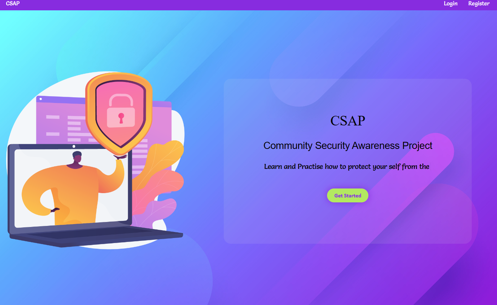

# CSAP-Community-Security-Awareness-Project-Full-stack

# CSAP (Comunity SCAM Awareness Program)

CSAP is a Comunity Scam awarness program with the base idea to share and create awarness on scam and its threats.

### what we're trying to do

we are trying to teach our comunity and loved ones how bad a scam call or scam link is and to at least prevent some by implementing one for educational and awarness purpose

`Authors`

```
@Buka-pitch (Biruk Yonas)
```
